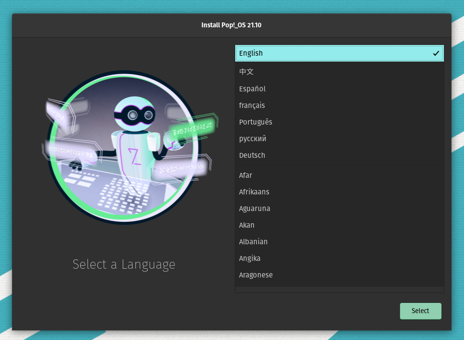
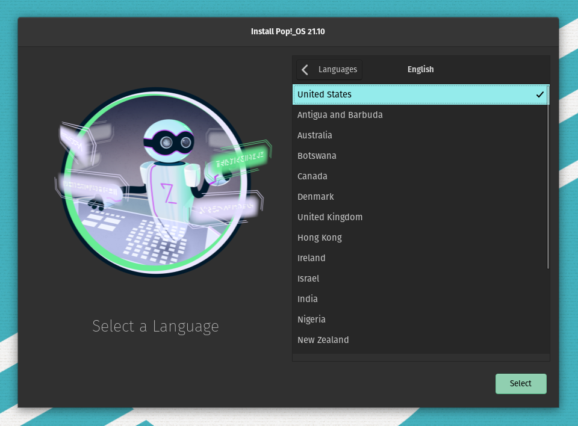
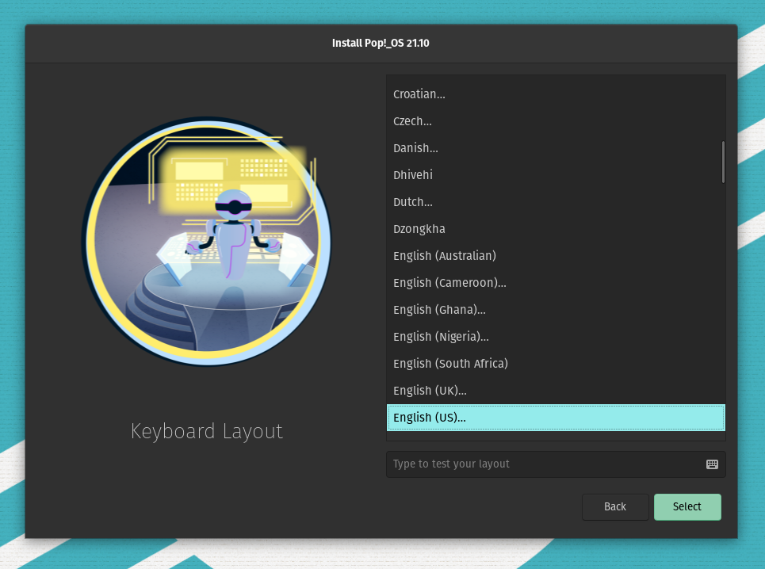
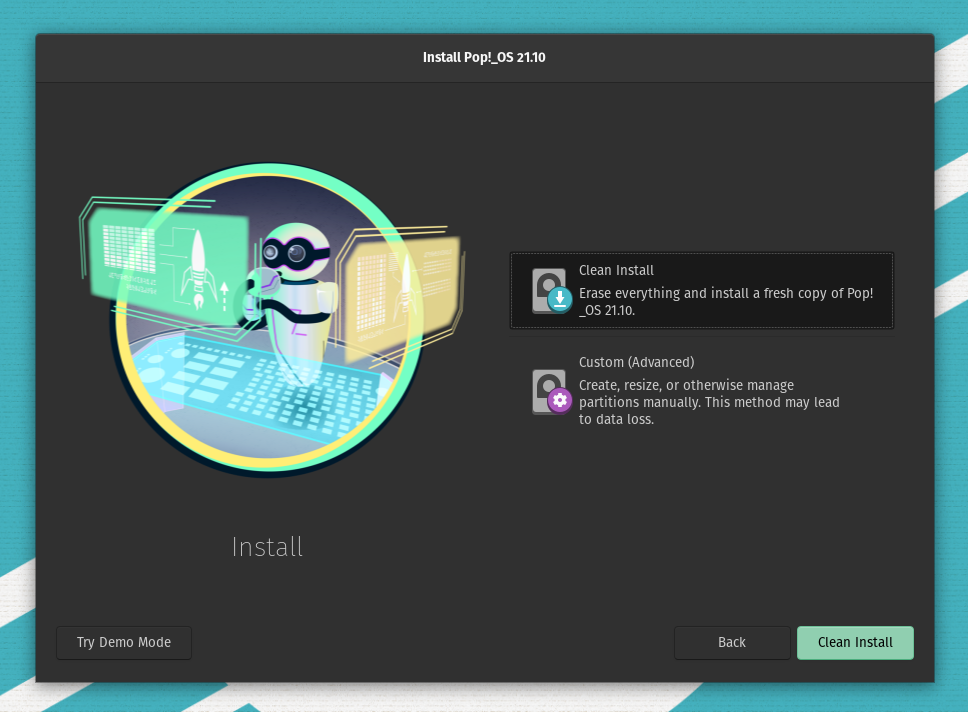
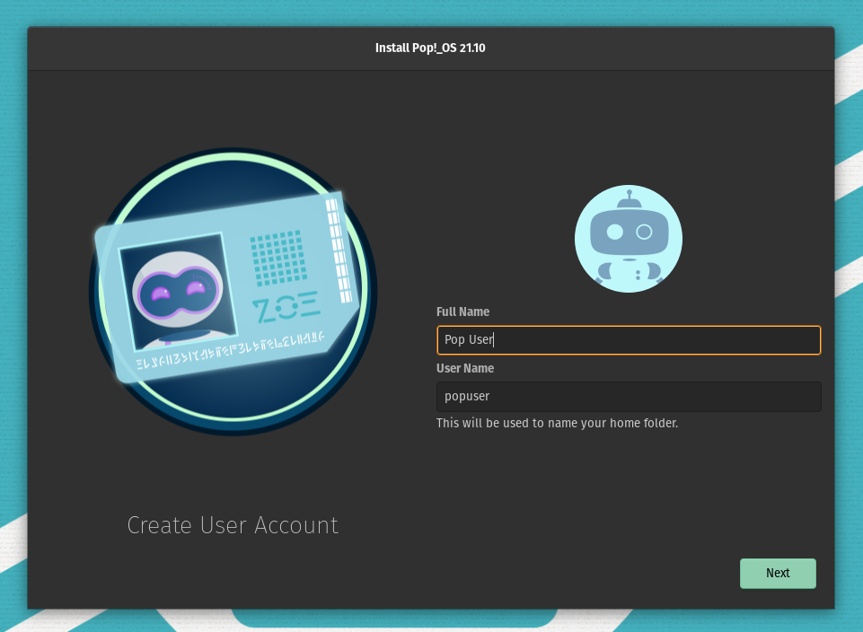
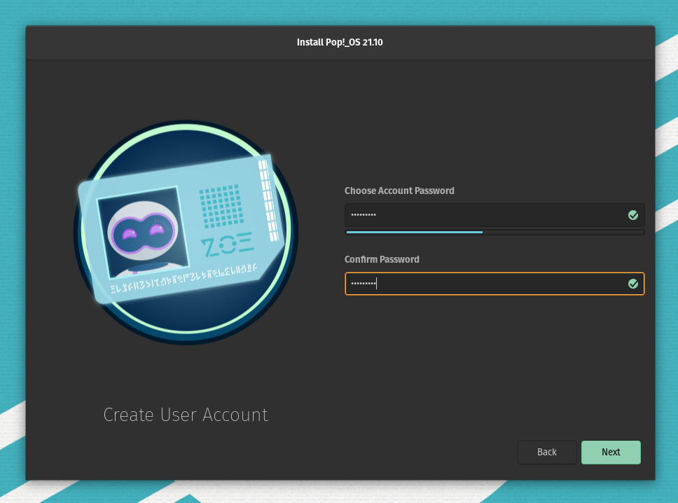
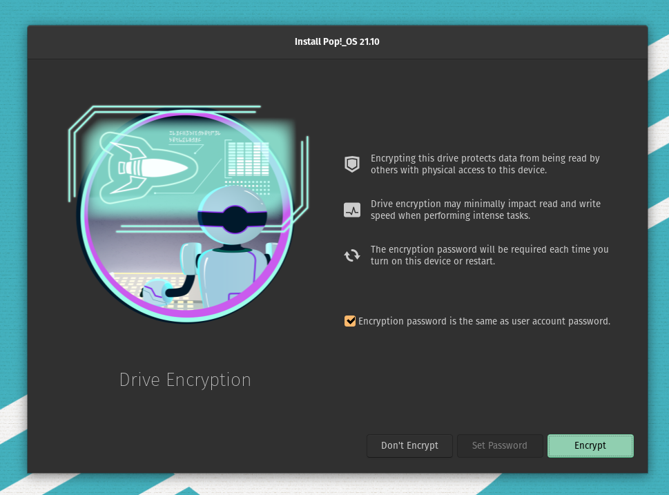

# Installing Pop!_OS

The Pop!_OS installer guides the user through setup of basic system settings:

- Locale and keyboard language
- Hard drive selection and partitioning (advanced)
- User account creation
- System disk encryption

## Installation

1. Choose a language.

2. Select a locale.

3. Select a keyboard input language.

4. Select a keyboard layout.

5. Choose the `Clean Install` option for a standard installation. This is the best option for new Linux users. 

>**Note**: The `Custom (Advanced)` option opens GParted. GParted allows users to choose partition tables and create custom partitions, among other options.  <!-- See Using [GParted Custom (Advanced)](advanced-installation.md) for more information. -->

6. Choose the target drive for the OS installation. Click `Erase and Install`.

7. Enter your first and last name, or a display name. A suggested username will populate in the User Name field.

>**Tip**: You don't need to type your username when logging into Pop!_OS normally, but it can be handy to remember when logging into a terminal session, logging in remotely via SSH, or performing certain configurations.

8. Enter the account password.

9. Choose to encrypt the drive, and optionally create a separate encryption password.

>**Note**: Encrypting the system disk ensures user data is secure in the event that someone gains unauthorized physical access to the device. 

10. Wait for the installation to complete. Click `Restart Device` when prompted.

